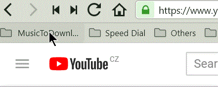

# Bookmarks to mp3

Download YouTube videos as mp3. From browser's bookmarks in few clicks.

(Created for [Vivaldi](https://vivaldi.com/) on Windows, probably works for Chrome and Opera)

## How to use it

1. Add YouTube videos to folder in bookmarks.
2. Run PowerShell script.

## Requirements

- youtube-dl installed

  - via chocolatey: `choco install youtube-dl`
  - or https://rg3.github.io/youtube-dl/
- ffmpeg installed. (This step is neccessary for extracting audio and thus to avoid "`ffprobe or avprobe not found. Please install one.`" error from youtube-dl output.)
  - via chocolatey: `choco install youtube-dl`
  - or https://ffmpeg.zeranoe.com/builds/

## Settings

1. Download `bookmarks2mp3.ps1`.
2. Edit path to bookmark file (it depends on browser).
3. Edit `bookmarkFolder` property to match folder in browser.

## Limitations

Script works only for Chrome (and other "clones" like Vivaldi and Opera). The reason is different structure for storing bookmarks information.

## Contributing

If you have any idea how to make script better, feel free to submit issue or pull-request.

